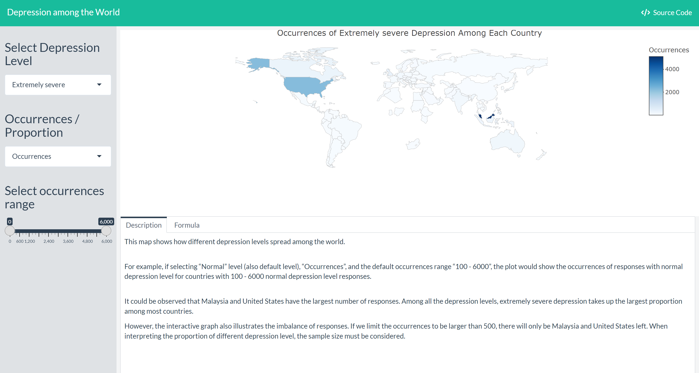

Here is the visualization work I have done.

## R Shiny

 * "Depression Matters": Demographic Factors Influencing Depression Level ([link](https://doloreshqq.github.io/p8105_final.github.io/index.html))
 
    * I created an R Shiny app illustrating the occurrences/proportion of different depression level across countries. ([link](https://doloreshqq.shinyapps.io/r_shiny_for_p8105/))

    